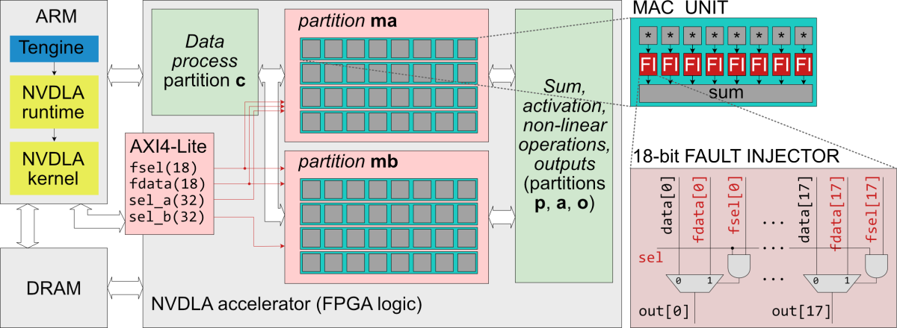

# ZYNQ NVDLA Fault Injection

This repository contains a modified NVDLA accelerator for the Zynq UltraScale+ platform. It utilizes [Tengine](https://github.com/OAID/Tengine) for neural network inference. The primary outcome of this project is the emulation of faults within the system.

This is an initial review-version of the repository, it will be further improved - we will include the necessary steps to create the software level (now you can find them here https://leiblog.wang/NVDLA-Xilinx-FPGA-Mapping)

## Project Overview

The project integrates Tengine and NVDLA as described in the following resources:
- Tengine and NVDLA Integration: https://github.com/LeiWang1999/ZYNQ-NVDLA
- NVDLA-Xilinx FPGA Mapping: https://leiblog.wang/NVDLA-Xilinx-FPGA-Mapping



## Key Components

### Software

The software component is located at [tm_classification_opendla_png_reduced.c](sw/Apps/tm_classification_opendla_png_reduced.c)

. The error level can be set at the following lines:
```c
void fi_write_data(im_devices_t* fi_devs, uint32_t fdata, uint32_t fsel, uint32_t sel_a, uint32_t sel_b)
{
    *fi_devs->fi_mux_fdata_in.ptr = fdata;
    *fi_devs->fi_mux_fsel_in.ptr = fsel;
    *fi_devs->fi_mux_sel_a.ptr = sel_a;
    *fi_devs->fi_mux_sel_b.ptr = sel_b;
}
```

### Hardware

The hardware fault injection is implemented in the [cmac](hw/nvdla_zcu104.ip_user_files/bd/design_1/ipshared/49a3/vmod/nvdla/cmac) folder, in particular [NV_NVDLA_CMAC_CORE_mac.v](hw/nvdla_zcu104.ip_user_files/bd/design_1/ipshared/49a3/vmod/nvdla/cmac/NV_NVDLA_CMAC_CORE_mac.v) and [fault_injection_mux.v](hw/nvdla_zcu104.ip_user_files/bd/design_1/ipshared/49a3/vmod/nvdla/cmac/fault_injection_mux.v) files. The control signals are exported to the top-level entity and connected using AXI GPIO interfaces to be settable from the CPU.

#### Verilog Signals
```verilog
input [18-1:0] fi_mux_fdata_in,
input [18-1:0] fi_mux_fsel_in,
input [32-1:0] fi_mux_sel_a,
input [32-1:0] fi_mux_sel_b
```

## Usage

To emulate faults, configure the error levels in the software and use the AXI GPIO interfaces to set the Verilog signals from the CPU.
