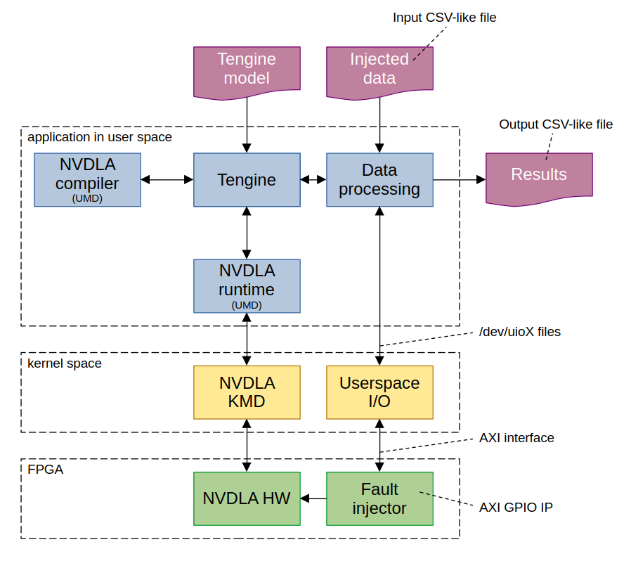

# 5. Applications in this repository

## 5.1 CIFAR-10 dataset for applications
CIFAR-10 is used for all applications to obtain the accuracy of neural networks. Two variants of the test part of the dataset were used.
The first variant is the whole test part, which consists of 1000 images per class (and 10 classes). The second variant is a reduced
to 10% of it's original size. This means only 100 images per class. The reduced data set was used for the following reasons
to speed up the accuracy evaluation. No significant difference from the full test part was found, but to obtain accurate
measurements, the use of the full test part is recommended.

To load images, Tengine support for png was used, so CIFAR-10 data (test part) was converted to png format.
with the following directory structure:
```
./CIFAR10
├── airplane
│   ├── 0001.png
│   ├── 0002.png
│   ├── ...
│   └── 1000.png
├── ...
└── truck
    ├── ...
    └── 1000.png
```

## 5.2 Image classification - FLOAT32@CPU
To test image classification with Tengine's neural network on CPU with floating-point calculation, use the example
`tm_classification_png_reduced.c`. The application should test the accuracy of the neural network on 100 images per class
from the CIFAR-10 dataset (converted to png files), which is only 10% of the original CIFAR-10 test part of the dataset. This is due to faster evaluation.
It can easily be changed to full range on test part (1000 images per class) via the `NUMBER_OF_SAMPLES` constant defined
in the source code.

Example arguments for ResNet-18:
```shell
./tm_classification_png_reduced -m /path/to/resnet18.tmfile -i /path/to/CIFAR10/ -g 32,32 -s 0.017,0.017,0.017 -w 104.007,116.669,122.679
```
Where `-m` is the path to the Tengine neural network. `-i` is the path to the directory containing the CIFAR-10 dataset.
`-g` is the expected resolution of the input image, the input images will be resized to this resolution (3-color images are expected, such as RGB).
are expected, e.g. RGB). The scale of each color is set with the `-s` argument. For the mean value use the `-w` argument.

After interfering all images, the final precision is printed.

## 5.3 Image classification - INT8@CPU
To test image classification with Tengine neural network on CPU with int calculation, use example
`tm_classification_int8_png_reduced.c`. The usage is the same as the float application. The only difference is the use of
quantized Tengine model. Tengine already have tool that perform quantization from FLOAT32 to INT8 model
(UINT8 is also supported). For more information and usage of this tool see
[Tengine documentation](https://github.com/OAID/Tengine/blob/tengine-lite/doc/docs_en/user_guides/quant_tool_int8.md).

## 5.4 Image classification - INT8@NVDLA
To test image classification with Tengine neural network on NVDLA with int computation, use example
`tm_classification_opendla_png_full.c` for the full test part of the dataset and `tm_classification_opendla_png_reduced.c` for the reduced part of the dataset.
for the reduced part of the dataset.

The usage of these applications is very similar to CPU interference:
```shell
./tm_classification_opendla_png_full -m /path/to/resnet18.tmfile -i /path/to/CIFAR10/ -g 32,32 -s 0.017,0.017,0.017 -w 104.007,116.669,122.679  -f /path/to/fault_injection.csv -f /path/to/output.csv
```
There are two extra arguments, `-f` for a CSV like file with fault injection (FI) information and `-d` argument for CSV like
output. Instead of simple accuracy measurement for non-fault case, these applications will perform FI specified in the
input file and store the final accuracy for each FI in the output file.

### 5.4.1 Architecture of example

There are two channels of communication.
1. AXI interface between NVDLA IP and CPU. The interface is served by NVDLA KMD <---> NVDLA UMD Runtime <---> Tengine.
2. AXI interface between AXI GPIO IP and CPU. This interface is added to the original NVLDA design and is used for
3. fault injection purposes. It's handled by Userspace I/O driver in the kernel (which creates /dev/uioX files for access)
   and then by an added part to the base Tengine example.



### 5.4.2 Input file format
The format of the input file is in CVS-like format, which looks like this:
```csv
0x00000000,0x00000000,0x00000000,0x00000000
0x00000000,0xffffffff,0x00000001,0x00000000
0x00000001,0xffffffff,0x00000001,0x00000000
...
```

> **_NOTE:_** Please note that even if the input file looks like CSV, it's not really CSV. For example double-quotes are not supported.

Each row contains data for a neural network accuracy evaluation under a specific FI. The meaning of each column is
- injected value
- mask for injected value
- multiplier selection in partition ma
- multiplier selection in partition mb

The injected bit can take the values 1 and 0, so the mask is needed to specify which bits should be injected and which should remain the same.
which should remain unchanged. To select a specific bit, set it to 1 in the mask. Injected value and mask
are shared by all multipliers and only 18 bits are used (but stored in 32 bit format). To select which multiplier
should be affected by FI. NVDLA has two parts of MAC units, `ma` and `mb`. This division is reflected in the multiplier selection.
Each MAC unit has 8 multipliers. To select x multiplier in y MAC, use the simple formula `y * 8 + x`.

### 5.4.3 Output file format
The output file will have similar format to the input file, but with additional columns and an extra row of additional
information. So it's possible to use output file as input. Added columns will be ignored, only extra row will be executed.

```csv
0x00000000,0x00000000,0x00000000,0x00000000,00631,00369
0x00000000,0xffffffff,0x00000001,0x00000000,00570,00430
0x00000001,0xffffffff,0x00000001,0x00000000,00580,00420
...
0x00000000,0x00000000,0x00000000,0x00000000,5988.021973,885944.433105,12.635010,4.527100
```

The first added column is the number of correctly classified images and the second added column is the number of
incorrectly classified images.

The extra row contains data for disabled FI for compatibility with input file and then extra columns with:
- model preparation time
- cumulative NVDLA evaluation time (image loading and waiting for FI is not counted)
- maximum NVDLA evaluation time
- minimum NVDLA evaluation time

Each time value is in milliseconds.

## Chapters
- [Chapter 1: NVLDA Fault Injection Introduction](./introduction.md)
- [Chapter 2: Hardware Design](./hardware.md)
- [Chapter 3: PetaLinux Preparation](./petalinux.md)
- [Chapter 4: Software Design](./software.md)
- [Chapter 5: Applications in this repository](./applications.md) (this chapter)