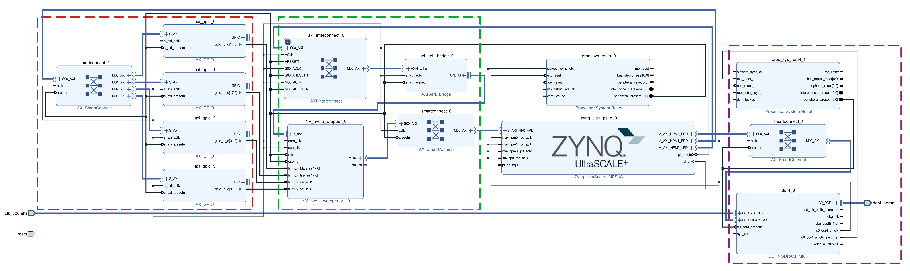
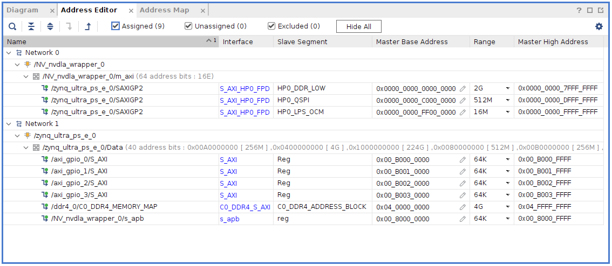

# 2. Hardware Design
# 2.1 RTL Generation
### 2.1.1 Environment Setup and RTL Generation
There is the official [Environment Setup Guide](http://nvdla.org/hw/v2/environment_setup_guide.html) for NVDLA RTL generation.

You need to get source code for NVDLA small configuration.
```shell
git clone https://github.com/nvdla/hw
git checkout nv_small
```

Then environment configuration is required with `make` command. Generation of RTL is not so dependent on a specific tool version.
For example these tools and version were used for project:
```
- cpp/gcc/g++ - gcc (GCC) 12.2.1 20230201
- perl - revision 5 version 36 subversion 0
- java - openjdk 20.0.1 2023-04-18
- python - Python 3.10.10
- clang - clang version 15.0.7
```

After that RTL can be generated.
```shell
./tools/bin/tmake -build vmod
```

The RTL output files can be found in the `out/nv_small/vmod` directory.

> **_NOTE:_** There is also unofficial Docker Image with prepared environment [farhanaslam/nvdla](https://hub.docker.com/r/farhanaslam/nvdla).

### 2.1.2 Modification of the RTL for FPGA
NVDLA is designed for ASIC, which means that it also has RTL for internal RAM. This is unwanted because on FPGA,  there
RAM block will be mapped into LUT instead of BRAM.  The easiest way to do this is to delete the `synth` directory in
`out/nv_small/vmod/rams`.

## 2.2 RTL modification for fault injection
To enable fault injection, source file with MAC unit was modified (in [cmac](hw/nvdla_zcu104.ip_user_files/bd/design_1/ipshared/49a3/vmod/nvdla/cmac) folder file [NV_NVDLA_CMAC_CORE_mac.v](hw/nvdla_zcu104.ip_user_files/bd/design_1/ipshared/49a3/vmod/nvdla/cmac/NV_NVDLA_CMAC_CORE_mac.v)).
Output from each multiplier was routed into new fi module [fault_injection_mux.v](hw/nvdla_zcu104.ip_user_files/bd/design_1/ipshared/49a3/vmod/nvdla/cmac/fault_injection_mux.v), which export modified signal
back to MAC unit for subsequent accumulation.

This leads to creation of new control signals.
```verilog
input [18-1:0] fi_mux_fdata_in,
input [18-1:0] fi_mux_fsel_in,
input [32-1:0] fi_mux_sel_a,
input [32-1:0] fi_mux_sel_b
```

## 2.3 Vivado Hardware Design
Vivado 2022.1 was used.

Due to porting the NVDLA on FPGA, there Verilog options were used:
```
VLIB_BYPASS_POWER_CG
NV_FPGA_FIFOGEN
FIFOGEN_MASTER_CLK_GATING_DISABLED
FPGA = 1
SYNTHESIS
DISABLE_TESTPOINTS
NV_SYNTHESIS
DESIGNWARE_NOEXIST = 1
RAM_DISABLE_POWER_GATING_FPGA
```

The NVDLA is using CSB interface for communication for processor. Because of no CSB to AXI converter, the CSB to APB
converter from the NVDLA source code was used. The wrapper for it was used from
[Lei Wang's blog post](https://leiblog.wang/NVDLA-Xilinx-FPGA-Mapping/#1-2-1-csb2apb). And APB was converted to AXI with
converter avaiable in Vivado.

The resulting block design contains these main sections:
- Fault injection (red)
- NVDLA (green)
- External memory (purple)

FI control signals are routed to AXI GPIO IP core to enable FI control from software.



Address mapping is as following


Due to usage of different Vivado and PetaLinux version, the hardware description must be exported in old HDF format with command:
```shell
write_hwdef -force -file <location>/filename.hdf
```

## 2.4 FPGA Utilization

| Resource | Available |   No FI | Constant FI | SW driven FI |
|----------|----------:|--------:|------------:|-------------:|
| LUT      |   230 400 |  94 438 |      94 456 |       96 081 |
| LUTRAM   |   101 760 |   5 112 |       5 112 |        5 113 |
| FF       |   460 800 | 104 732 |     104 717 |      106 150 |
| BRAM     |       312 |   91.50 |       91.50 |        91.50 |
| DSP      |      1728 |      35 |          35 |           35 |