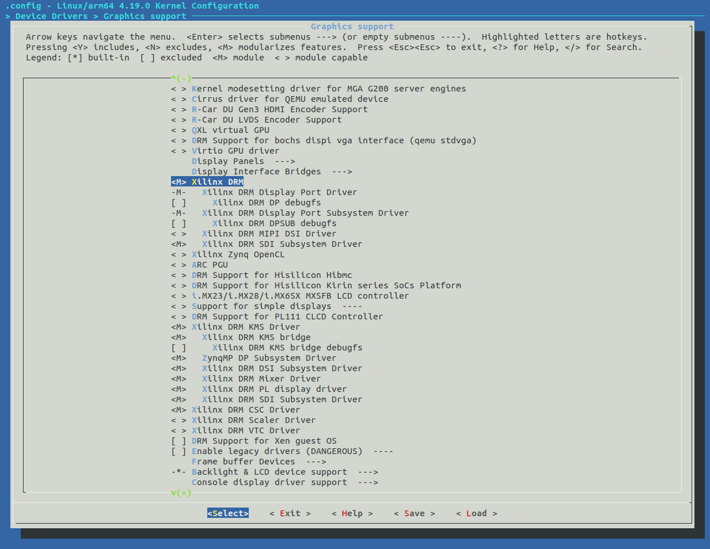
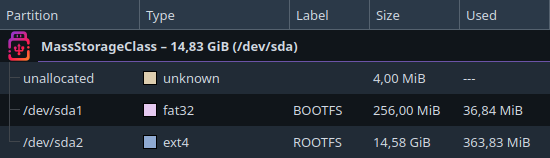

# 3. PetaLinux
For compiling Linux Kernel PetaLinux 2019.1 was used.

Create a new project and load HDF file.
```shell
petalinux-create -t project --template zynqMP -n smalldla_zcu104
cd smalldla_zcu104/
petalinux-config --get-hw-description=./
```

> **_NOTE:_** For more details about project creation see [PetaLinux Reference Guide](https://docs.xilinx.com/v/u/2019.1-English/ug1144-petalinux-tools-reference-guide).

## 3.1 Kernel Configuration
After that, configure Kernel.
```shell
petalinux-config -c kernel
```

### 3.1.1 General setup

Disable `Initial RAM filesystem and RAM disk (initramfs/initrd) support`.

Enable `Compile also drivers which will not load`.

And also optionally set hostname in the `Default hostname`.

### 3.1.2 Device Drivers > Graphics support
DRM drivers must be compiled as a module, otherwise loading the NVDLA driver will fail with the error "failed to register drm device".

Select these options as module (marked with M):
- Xilinx DRM
- Xilinx DRM Display Port Driver
- Xilinx DRM Display Port Subsystem Driver
- Xilinx DRM KMS Driver
- Xilinx DRM KMS bridge
- ZynqMP DP Subsystem Driver
- Xilinx DRM DSI Subsystem Driver
- Xilinx DRM Mixer Driver
- Xilinx DRM PL display driver
- Xilinx DRM SDI Subsystem Driver
- Xilinx DRM CSC Driver

Disable `Xilinx DRM Scaler Driver`.



### 3.1.3 Device Drivers > PHY Subsystem
Attempting to compile the PHY driver as a module will fail. Only compiled in option will work.

Select `Xilinx ZynqMP PHY driver` as compiled in (marked with *).

## 3.2 NVDLA Module
Create a new PetaLinux module for NVDLA kernel driver (KMD).
```shell
petalinux-create -t modules -n opendla --enable
```

The module folder will be in `project-spec/meta-user/recipes-modules/opendla`.

Prepared module with modified NVDLA KMD can be found in [sw/PetaLinux/recipes-modules/](../sw/PetaLinux/recipes-modules/).

### 3.2.1 Modification of NVDLA KMD

The following things were changed in original [NVDLA KMD](https://github.com/nvdla/sw) driver:
1. Reserved memory address for NVDLA and code around DMA for compatibility with Kernel 4.19. All in [nvdla_gem.c](../sw/PetaLinux/recipes-modules/opendla/files/nvdla_gem.c) file.
```c
dma = dma_declare_coherent_memory(drm->dev, 0xC0000000, 0xC0000000,
		0x40000000, DMA_MEMORY_MAP | DMA_MEMORY_EXCLUSIVE);
if (!(dma & DMA_MEMORY_MAP)) {
	err = -ENOMEM;
	goto unref;
}
```
with:
```c
dma = dma_declare_coherent_memory(drm->dev, 0x40000000, 0x40000000,
		0x40000000, DMA_MEMORY_EXCLUSIVE);
if (dma) {
	err = -ENOMEM;
	goto unref;
}
```
> **_NOTE:_** See the documentation for the [dma_declare_coherent_memory](https://www.kernel.org/doc/html/v4.19/driver-api/infrastructure.html#c.dmam_declare_coherent_memory) function for more details.

2. Changed macro definition to select nv_small configuration in file [opendla.h](../sw/PetaLinux/recipes-modules/opendla/files/opendla.h).
```c
#define DLA_2_CONFIG
```

### 3.2.2 Makefile

It's not possible to use original Makefile from NVDLA KMD because of PetaLinux, so [Makefile](../sw/PetaLinux/recipes-modules/opendla/files/Makefile) from PetaLinux was modified to successfully compile NVDLA KMD. 

```makefile
###append all of sources###
opendla-objs := nvdla_core_callbacks.o nvdla_gem.o scheduler.o engine.o bdma.o conv.o sdp.o cdp.o pdp.o rubik.o cache.o common.o engine_data.o engine_isr.o engine_debug.o
###########################
```

> **_NOTE:_** See [PetaLinux Reference Guide](https://docs.xilinx.com/v/u/2019.1-English/ug1144-petalinux-tools-reference-guide) section Creating and Adding Custom Modules on page 74 for more details.

### 3.2.3 Configuration BB File

PetaLinux have BB config file which must contains all required files. See [opendla.bb](../sw/PetaLinux/recipes-modules/opendla/opendla.bb) for more details.

## 3.3 Device Tree

The hardware components created in FPGA must be specified in Device Tree to visible by Linux. Empty Device Tree file should be located at `project-spec/meta-user/recipes-bsp/device-tree/files/system-user.dtsi`.
The modified version with following changes can be found in [here](../sw/PetaLinux/system-user.dtsi):
1. Added external DDR4 memory.
2. Reserved memory for NVDLA.
3. Added all four AXI GPIOs with generic uio driver.
4. Added NVDLA.

> **_NOTE:_** See [Linux Reserved Memory](https://xilinx-wiki.atlassian.net/wiki/spaces/A/pages/18841683/Linux+Reserved+Memory) for more details about memory reservation.

With this configuration done, it's possible to build PetaLinux and export package.

```shell
petalinux-build
petalinux-package --boot --fsbl images/linux/zynqmp_fsbl.elf --fpga ./nvdla_zcu104.bit --u-boot --force
```

## 3.4 SD Card Preparation

Create correct partitions on your SD card for PetaLinux. For more details you can see [PetaLinux Reference Guide](https://docs.xilinx.com/v/u/2019.1-English/ug1144-petalinux-tools-reference-guide) section Configuring SD Card ext File System Boot on page 64.



### 3.4.1 BOOTFS (fat32) partition
First partition, the boot one, contains `BOOT.BIN` and `image.ub` file.

### 3.4.2 ROOTFS (ext4) partition
Second partition contains root file system for Linux. Usually this partition contain file system created by PetaLinux,
but it's more practical to use root file system from some Linux distribution to have package manager. Because of this,
it will be possible to compile NVDLA UMD and Tengine on device.

The custom root file system must be from distro version which uses the same Kernel version, for example Debian 10.13,
which can be obtained from [here](https://rcn-ee.com/rootfs/eewiki/minfs/debian-10.13-minimal-arm64-2022-12-20.tar.xz).

The original rootfs from PetaLinux contains compiled modules (including NVDLA KMD) which are required for the correct
operation of the system. To ensure this, copy all modules from original rootfs located in `/lib/modules/4.19.0-xilinx-v2019.1/`
into custom rootfs on the SD card.

Now the SD card can be inserted into Zynq and boot up.